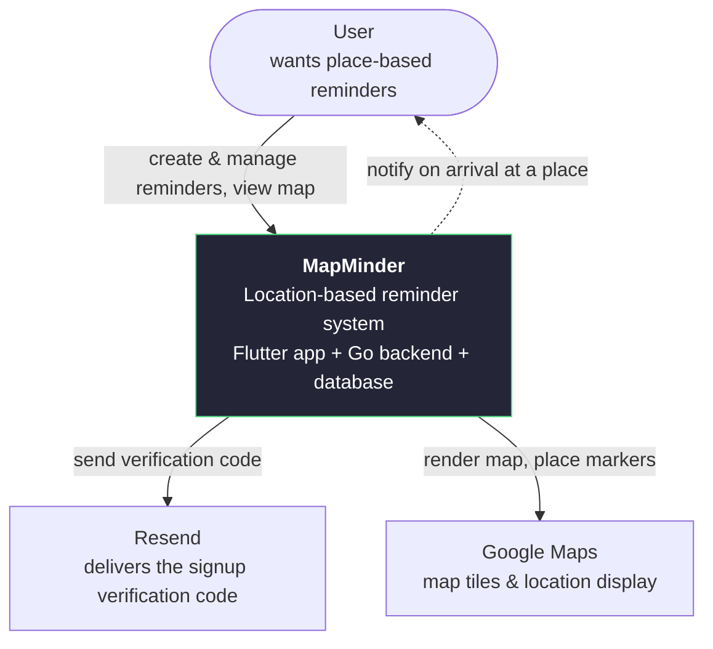
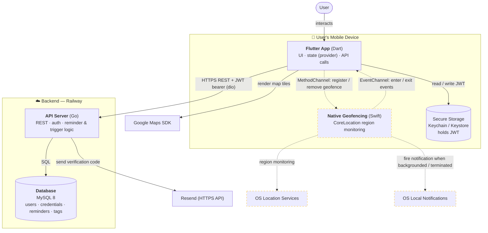

[toc]

# MapMinder — System Architecture

> **Status:** Draft · **Last updated:** 2026-09-10
>
> This document gives the *zoomed-out* view of MapMinder: what the system is,
> what it depends on, and how the deployable pieces fit together. For the
> *zoomed-in* views, see [`reminder_flow.md`](./reminder_flow.md),
> [`auth_flow.md`](./auth_flow.md) *(to be written)*, and
> [`er_diagram.md`](./er_diagram.md).

It follows the [**C4 model**](https://c4model.com/): describe the system at
increasing levels of zoom and stop when it stops being useful.

- **Level 1 — System Context:** MapMinder as one box + who/what it talks to.
- **Level 2 — Container:** the deployable/running pieces and how they communicate.
- **Level 3 — Component:** the layering *inside* the app — see the
  [Component section](#level-3--component-flutter-app) below.

Legend for the diagrams: **solid arrows = implemented today**,
**dashed arrows = planned / not yet built** (geofencing & the native layer).

---

## Repositories

MapMinder is split across four repositories under the
[`MapMinder`](https://github.com/MapMinder) GitHub organisation:

| Repo | Contents |
|---|---|
| [`mapminder_mobile`](https://github.com/MapMinder/mapminder_mobile) | Flutter app (Dart). |
| [`mapminder_backend`](https://github.com/MapMinder/mapminder_backend) | Go REST API. |
| [`migration`](https://github.com/MapMinder/migration) | `golang-migrate` SQL migrations for the MySQL schema. |
| [`mapminder_documents`](https://github.com/MapMinder/mapminder_documents) | This document and the other design docs. |

---

## Level 1 — System Context

What MapMinder is, and the external systems it cannot function without.



| Actor / System | Type | Role |
|---|---|---|
| **User** | Person | Creates reminders pinned to places; gets notified on arrival. |
| **Resend** | External | Sends the one-time code that verifies a new user's email at signup. Used only in release builds — during development the code is written to the server log. |
| **Google Maps** | External | Map tiles and marker rendering inside the app (needs a Maps API key). |

> **Auth is first-party.** MapMinder previously used Google Sign-In; it was
> dropped because App Store Guideline 4.8 forces any app with a third-party
> social login to also offer Sign in with Apple, which needs a paid Apple
> Developer entitlement we are avoiding. Sign-in is now email + password, with a
> one-time code that verifies the email address at signup. Everything is owned
> by our backend. Detail: [`auth_flow.md`](./auth_flow.md).

---

## Level 2 — Container

The pieces that run independently, and the protocols/credentials between them.



### Containers

| Container | Tech | Responsibility |
|---|---|---|
| **Flutter App** | Dart / Flutter | All UI, state (`provider` + `ChangeNotifier`), and the API client. Runs on the user's device. |
| **Native Geofencing** *(planned)* | Swift (iOS) | Registers OS geofences and fires the local notification on arrival — including when the app is terminated. Talks to Dart over platform channels. iOS-only for the MVP. |
| **Secure Storage** | Keychain / Keystore | Stores the JWT via `flutter_secure_storage`. |
| **API Server** | Go (Gin, GORM) | REST API. Owns the auth flow (email + password, signup verification code, JWT issuance), reminder CRUD, and the trigger/cooldown logic. |
| **Database** | MySQL 8 | Persists users, auth credentials, reminders, tags, recurrence (see `er_diagram.md`). |

### Communication

| From → To | Protocol | Credential | Notes |
|---|---|---|---|
| App → API Server | HTTPS REST (`dio`) | JWT bearer | Base URL from an env var. JWT attached by a `dio` interceptor on every request. |
| App → Secure Storage | Local | — | JWT read on each request, written after sign-in. |
| App → Google Maps SDK | Native SDK | Maps API key | Tile rendering + markers. |
| API → Resend | HTTPS API | Resend API key | Sends the signup verification code. Dev builds skip this and log the code. |
| API → Database | SQL | DB creds | Responses wrapped in a `{ "result": … }` envelope. |
| App (Dart) ⇄ Native *(planned)* | MethodChannel + EventChannel | — | MethodChannel for register/remove (one-shot); EventChannel for the enter/exit stream. |
| Native → OS Notifications *(planned)* | OS API | — | Fired from native, because no Flutter engine is running when the app is terminated. |

---

## Level 3 — Component (Flutter App)

Inside the app, each feature is layered. Request flow, using *reminders* as the
example:

```
Screen / Widget
   → Notifier        (ChangeNotifier — holds UI state, notifies listeners)
      → Controller   (input validation, builds DTOs)
         → Service   (feature-level orchestration)
            → Repository  (HTTP calls, JSON ⇄ domain mapping, error handling)
               → HttpClient (shared dio instance + JWT interceptor)
```

> ⚠️ **Known inconsistency:** today the `Service` layer is a pure pass-through
> to the `Repository`. Decide whether it has a purpose (caching, multi-repo
> orchestration) or should be removed — and record that decision. See the
> open questions below.

Cross-cutting pieces live in `lib/core/` (`HttpClient`, `SecurityStore`,
`AppLogger`, `ExternalHttpClient`) and `lib/shared/`.

---

## Trust boundaries

- **Device ↔ Backend** is the main boundary. The app holds only a JWT; all
  authority lives server-side.
- Identity is proven by email + password. Email ownership is proven once at
  signup by a one-time code; the backend generates and verifies it, and the app
  never sees more than "code accepted / rejected".
- Passwords and verification codes are stored hashed, never in clear text. The
  code is short-lived and single-use.
- The JWT lives in OS-backed secure storage (Keychain / Keystore), not in plain
  shared preferences.

---

## Decisions

- **Auth model** — email + password. A one-time code emailed at signup verifies
  the address; login itself is password-only. Drives `auth_flow.md`.
- **Email provider** — Resend. Not needed for local development (codes are
  logged).
- **Backend host** — Railway: API container + managed MySQL add-on.
- **Notifications** — local only (fired by the device). No APNs/FCM.
- **Platform** — iOS only. Android is not in scope.

## Open question

- **Service layer** — the `Service` layer (Level 3) is currently a pass-through
  to the `Repository`. Whether it earns its place needs a code-level review;
  out of scope for the current cleanup.
