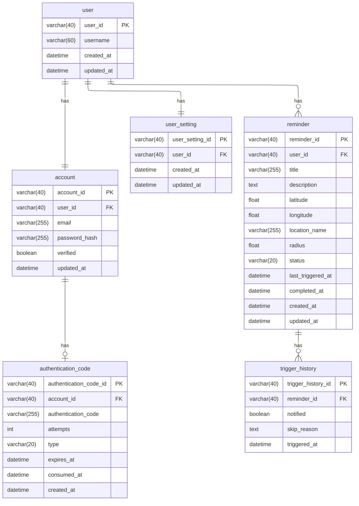

# Database Schema

```mermaid
---
config:
    layout: elk
---
erDiagram

user {
    varchar(40) user_id PK
    varchar(60) username
    datetime created_at
    datetime updated_at
}

account {
    varchar(40) account_id PK
    varchar(40) user_id FK
    varchar(255) email
    varchar(255) password_hash
    boolean verified
    datetime updated_at
}

authentication_code {
    varchar(40) authentication_code_id PK
    varchar(40) account_id FK
    varchar(255) authentication_code
    int attempts
    varchar(20) type
    datetime expires_at
    datetime consumed_at
    datetime created_at
}

user_setting {
    varchar(40) user_setting_id PK
    varchar(40) user_id FK
    datetime created_at
    datetime updated_at
}

reminder {
    varchar(40) reminder_id PK
    varchar(40) user_id FK
    varchar(255) title
    text description
    float latitude
    float longitude
    varchar(255) location_name
    float radius
    varchar(20) status
    datetime last_triggered_at
    datetime completed_at
    datetime created_at
    datetime updated_at
}

trigger_history {
    varchar(40) trigger_history_id PK
    varchar(40) reminder_id FK
    boolean notified
    text skip_reason
    datetime triggered_at
}

user ||--o{ reminder : has
user ||--|| account : has
user ||--|| user_setting : has
account ||--o| authentication_code : has
reminder ||--o{ trigger_history : has
```
