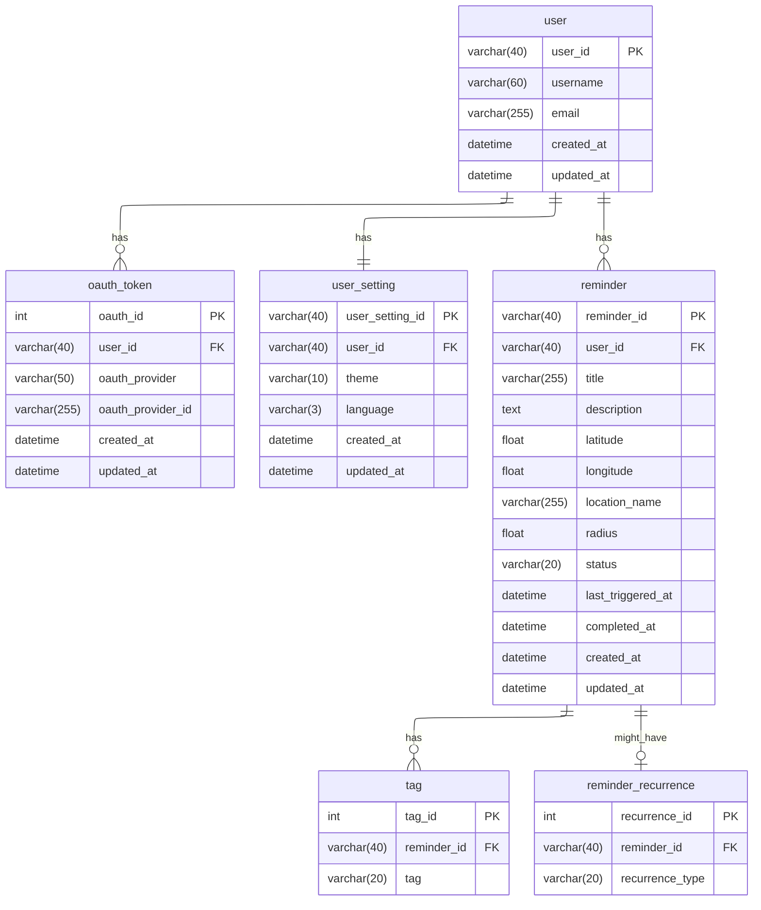

# Database Schema

```mermaid
---
config:
    layout: elk
---
erDiagram

user {
    varchar(40) user_id PK
    varchar(60) username
    varchar(255) email
    datetime created_at
    datetime updated_at
}

oauth_token {
    int oauth_id PK
    varchar(40) user_id FK
    varchar(50) oauth_provider
    varchar(255) oauth_provider_id
    datetime created_at
    datetime updated_at
}

user_setting {
    varchar(40) user_setting_id PK
    varchar(40) user_id FK
    varchar(10) theme
    varchar(3) language
    datetime created_at
    datetime updated_at
}

reminder {
    varchar(40) reminder_id PK
    varchar(40) user_id FK
    varchar(255) title
    text description
    float latitude
    float longitude
    varchar(255) location_name
    float radius
    varchar(20) status
    datetime last_triggered_at
    datetime completed_at
    datetime created_at
    datetime updated_at
}

tag {
    int tag_id PK
    varchar(40) reminder_id FK
    varchar(20) tag
}

reminder_recurrence {
    int recurrence_id PK
    varchar(40) reminder_id FK
    varchar(20) recurrence_type
}

user ||--o{ reminder : has
user ||--o{ oauth_token : has
user ||--|| user_setting : has
reminder ||--o{ tag : has
reminder ||--o| reminder_recurrence : might_have
```
