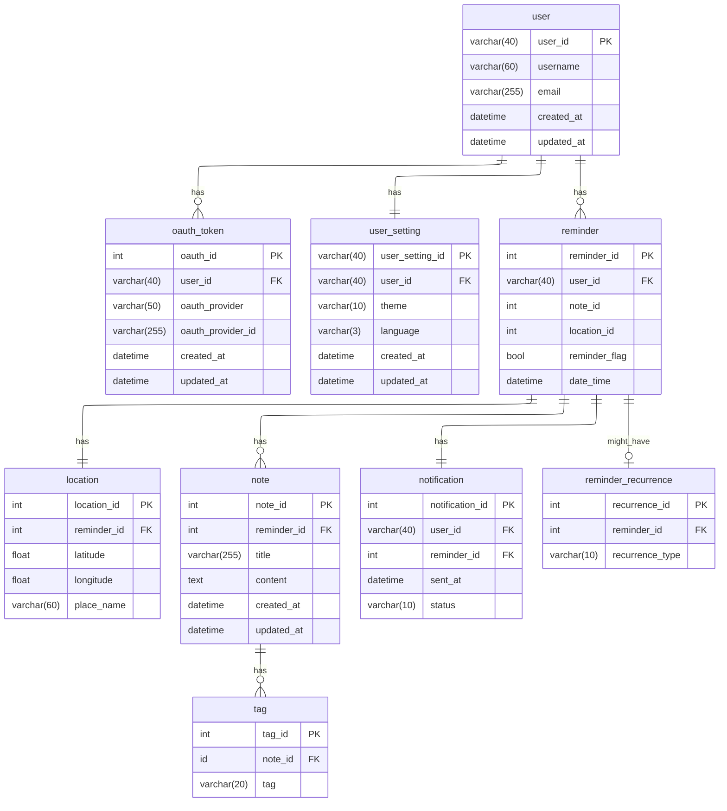

# Database Schema

```mermaid
---
config:
    layout: elk
---
erDiagram

oauth_token {
    int oauth_id PK
    varchar(40) user_id FK 
    varchar(50) oauth_provider
    varchar(255) oauth_provider_id
    datetime created_at
    datetime updated_at
}

user_setting {
    varchar(40) user_setting_id PK
    varchar(40) user_id FK
    varchar(10) theme
    varchar(3) language
    datetime created_at
    datetime updated_at
}

user {
    varchar(40) user_id PK
    varchar(60) username
    varchar(255) email
    datetime created_at
    datetime updated_at
}

tag {
    int tag_id PK
    id note_id FK
    varchar(20) tag
}

location {
    int location_id PK
    int reminder_id FK
    float latitude
    float longitude
    varchar(60) place_name
}

reminder {
    int reminder_id PK
    varchar(40) user_id FK
    int note_id
    int location_id
    bool reminder_flag
    datetime date_time
}

note {
    int note_id PK
    int reminder_id FK
    varchar(255) title
    text content
    datetime created_at
    datetime updated_at
}

notification {
    int notification_id PK
    varchar(40) user_id FK
    int reminder_id FK
    datetime sent_at
    varchar(10) status
}

reminder_recurrence {
    int recurrence_id PK
    int reminder_id FK
    varchar(10) recurrence_type
}

user ||--o{ reminder : has
user ||--o{ oauth_token : has
user ||--|| user_setting : has
reminder ||--o{ note : has
note ||--o{ tag : has
reminder ||--|| location : has
reminder ||--|| notification : has
reminder ||--o| reminder_recurrence : might_have
```
