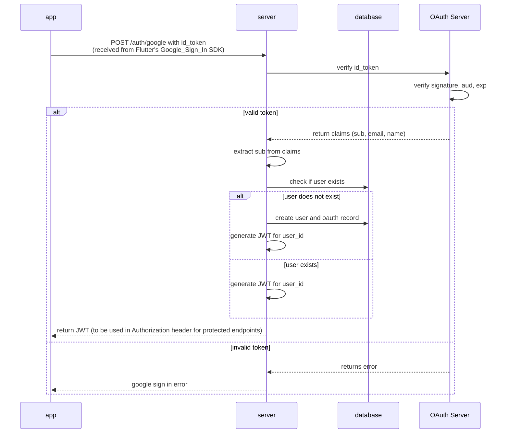

# Backend authentication flow - Google sign in(MVP)

---

- [Sequence Diagram](#sequence-diagram)
- [Google ID Token Verification - Endpoint & Response](#google-id-token-verification---endpoint--response)
    - [Endpoint](#endpoint)
    - [response](#response)

---

## Sequence Diagram



---

## Google ID Token Verification - Endpoint & Response

### Endpoint

> GET https://oauth2.googleapis.com/tokeninfo?id_token=<ID_TOKEN>

### response

**valid token response**

```json
{
  "iss": "https://accounts.google.com",
  "azp": "YOUR_GOOGLE_CLIENT_ID.apps.googleusercontent.com",
  "aud": "YOUR_GOOGLE_CLIENT_ID.apps.googleusercontent.com",
  "sub": "1078561234567890",
  "email": "user@example.com",
  "email_verified": "true",
  "name": "John Doe",
  "picture": "https://lh3.googleusercontent.com/a-/AOh14Gg1234567890",
  "given_name": "John",
  "family_name": "Doe",
  "locale": "en",
  "iat": "1686768000",
  "exp": "1686771600"
}
```

**invalid token response**

```json
{
  "error_description": "Invalid Value"
}
```
