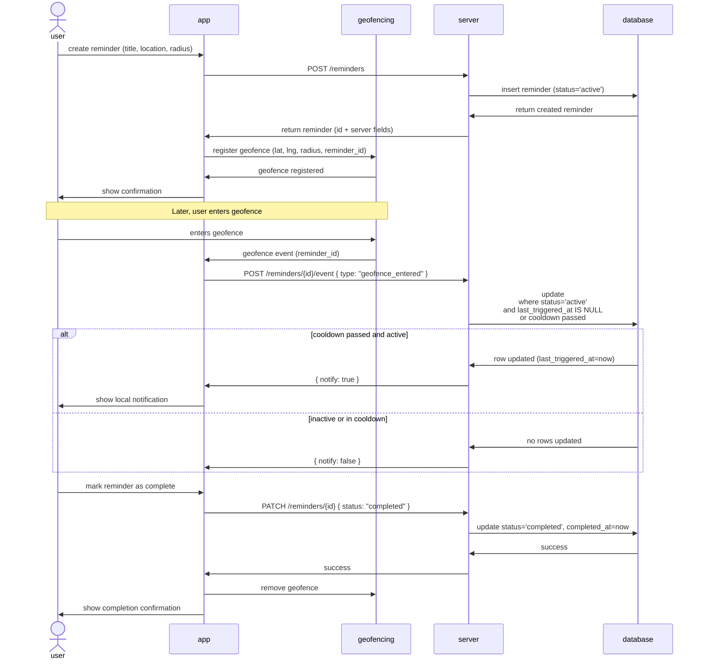

# Reminder feature flow

# TOC
- [TOC](#toc)
    - [sequence](#sequence)
    - [Geofencing – iOS MVP Plan](#geofencing--ios-mvp-plan)
        - [Scope](#scope)
        - [Architecture](#architecture)
        - [Permissions](#permissions)
        - [Behavior](#behavior)

## sequence

---

## Geofencing – iOS MVP Plan
### Scope

- Platform: iOS only
- Framework: Flutter (UI)
- Native layer: Swift
- No third-party geofencing plugins

### Architecture
Flutter → MethodChannel → Native Swift → CoreLocation (Region Monitoring)

**Flutter:**
- Sends latitude, longitude, radius, identifier
- Receives enter/exit events if app is active

**Swift:**
- Registers CLCircularRegion
- Handles didEnterRegion / didExitRegion
- Triggers local notification if app is backgrounded or terminated

### Permissions
**Required:**
- Always Location permission
- Background mode: Location updates

**Info.plist:**
- NSLocationWhenInUseUsageDescription
- NSLocationAlwaysAndWhenInUseUsageDescription

### Behavior
- Works in foreground, background, and terminated state
- Max 20 regions
- Radius ≥ 100m
- Not real-time GPS tracking
