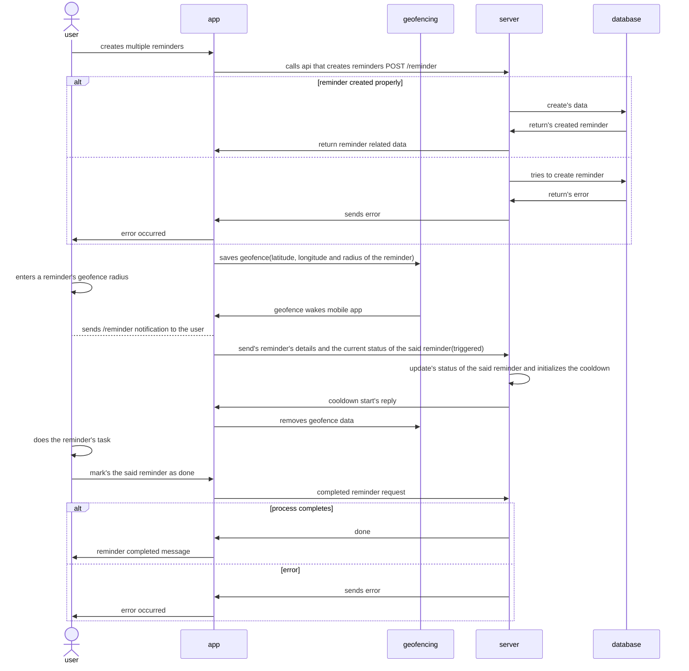

# Reminder feature flow

# TOC

- [Reminder feature flow](#reminder-feature-flow)
- [TOC](#toc)
    - [sequence](#sequence)

## sequence

```mermaid
sequenceDiagram
actor user
participant mf as app
participant gf as geofencing
participant mb as server
participant db as database

user->>mf: creates multiple reminders
mf->>mb: calls api that creates reminders POST /reminder 
    alt reminder created properly
    mb->>db: create's data
    db->>mb: return's created reminder
    mb->>mf: return reminder related data
else
    mb->>db: tries to create reminder
    db->>mb: return's error
    mb->>mf: sends error
    mf->>user: error occurred
end
mf->>gf: saves geofence(latitude, longitude and radius of the reminder)
user->>user: enters a reminder's geofence radius
gf->>mf: geofence wakes mobile app
mf-->user: sends /reminder notification to the user
mf->>mb: send's reminder's details and the current status of the said reminder(triggered)
mb->>mb: update's status of the said reminder and initializes the cooldown
mb->>mf: cooldown start's reply
mf->>gf: removes geofence data
user->>user: does the reminder's task
user->>mf: mark's the said reminder as done
mf->>mb: completed reminder request
alt process completes
    mb->>mf: done
    mf->>user: reminder completed message
else error
    mb->>mf: sends error
    mf->>user: error occurred
end
```
