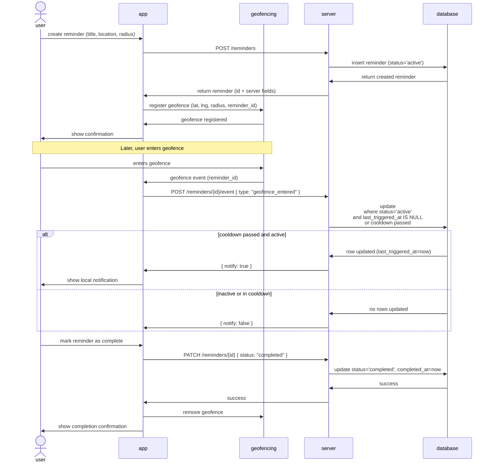

# Reminder
---

- [Sequence Diagram](#sequence-diagram)
- [Geolocation validity](#geolocation-validity)
    - [WGS84(World Geodetic System 1984)](#wgs84world-geodetic-system-1984)
- [Geofencing – iOS MVP Plan](#geofencing--ios-mvp-plan)
    - [Scope](#scope)
    - [Architecture](#architecture)
    - [Permissions](#permissions)
    - [Behavior](#behavior)
- [References](#references)


## Sequence Diagram




## Geolocation validity
### WGS84(World Geodetic System 1984)
- A valid WGS84[^1] is defined as the following:
    - **Latitude:** must be between -90.0 and 90.0(degrees)
    - **Longitude:** must be between -180.0 and 180.0(degrees)
- WGS84 also defines and altitude component but this does not apply for our usecase so we will not validate this
- NULL Island(0.0, 0.0) is a valid coordinate according to WGS84 but we will not use this as a valid location.(Again does not satisfy our usecase)


## Geofencing – iOS MVP Plan
### Scope

- Platform: iOS only
- Framework: Flutter (UI)
- Native layer: Swift
- No third-party geofencing plugins

### Architecture
Flutter → MethodChannel → Native Swift → CoreLocation (Region Monitoring)

**Flutter:**
- Sends latitude, longitude, radius, identifier
- Receives enter/exit events if app is active

**Swift:**
- Registers CLCircularRegion
- Handles didEnterRegion / didExitRegion
- Triggers local notification if app is backgrounded or terminated

### Permissions
**Required:**
- Always Location permission
- Background mode: Location updates

**Info.plist:**
- NSLocationWhenInUseUsageDescription
- NSLocationAlwaysAndWhenInUseUsageDescription

### Behavior
- Works in foreground, background, and terminated state
- Max 20 regions
- Radius ≥ 100m
- Not real-time GPS tracking

### Reminder State model
Reminder State Model

- States: active, inactive, completed
- completed is terminal
- Only active can trigger
- Cooldown is independent of status

Allowed transitions:

```
active   → inactive
inactive → active
active   → completed
inactive → completed
```

## References
[^1]: [WGS84(World Geodetic System 1984)](https://en.wikipedia.org/wiki/World_Geodetic_System)

