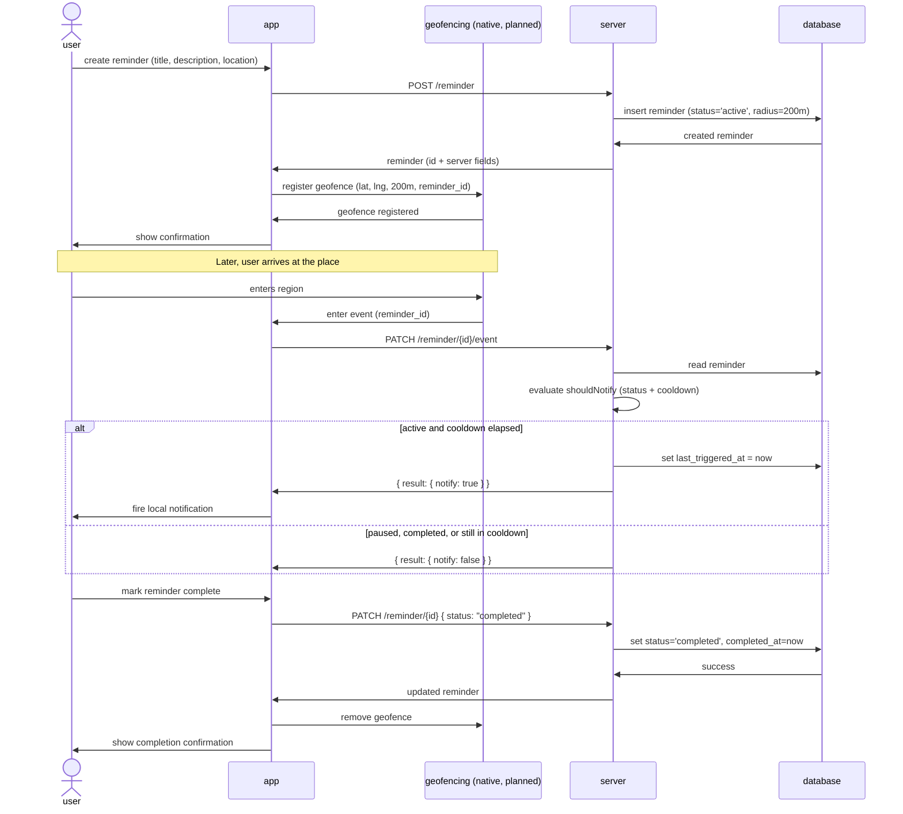

# Reminder

> **Status:** Draft · **Last updated:** 2026-09-10
> Describes how a reminder is created, how it triggers on arrival, and the
> geofencing plan for the iOS MVP. Zoomed-out view: [`architecture.md`](./architecture.md).

---

- [Sequence Diagram](#sequence-diagram)
- [Endpoints referenced](#endpoints-referenced)
- [Trigger / cooldown rules](#trigger--cooldown-rules)
- [Reminder state model](#reminder-state-model)
- [Geolocation validity](#geolocation-validity)
- [Geofencing – iOS MVP plan](#geofencing--ios-mvp-plan)
- [Known gaps](#known-gaps)
- [References](#references)

---

## Sequence Diagram



---

## Endpoints referenced

All reminder routes sit behind the JWT middleware (`/reminder` group).

| Method & path | Purpose | Response body |
|---|---|---|
| `POST /reminder` | Create a reminder. Server forces `status='active'` and `radius=200`; any client-sent radius is ignored today. | `{ "result": <reminder> }` |
| `GET /reminder?status=<active\|paused\|completed>` | List the caller's reminders filtered by status. | `{ "result": [<reminder>] }` |
| `GET /reminder/{id}` | Fetch one reminder. | `{ "result": <reminder> }` |
| `PATCH /reminder/{id}` | Update fields, including `status`. Setting `status='completed'` stamps `completed_at`. | `{ "result": <reminder> }` |
| `DELETE /reminder/{id}` | Delete a reminder. | — |
| `PATCH /reminder/{id}/event` | Report a geofence enter event. Server decides whether to notify. | `{ "result": { "notify": <bool> } }` |

---

## Trigger / cooldown rules

Decision lives **server-side**, in `shouldNotify`:

1. If `status != 'active'` → `notify: false`.
2. Else if `last_triggered_at IS NULL` (never fired) → `notify: true`.
3. Else → `notify: true` only if `last_triggered_at` is more than **10 minutes**
   before now.

The cooldown is a fixed **10 minutes**, hard-coded — not configurable per
reminder. When `notify` is true the server also updates `last_triggered_at`
to now, inside the same transaction.

The app treats `notify: true` as "show the local notification" and
`notify: false` as "stay silent".

---

## Reminder state model

- **States:** `active`, `paused`, `completed`
- `completed` is terminal
- Only `active` reminders can trigger a notification
- The cooldown timer is independent of the status
- `completed_at` is set the moment status becomes `completed`

Intended transitions:

```
active   → paused
paused   → active
active   → completed
paused   → completed
```

> These transitions are currently enforced **only by the app**. The backend's
> `PATCH /reminder/{id}` applies whatever status it is given without validating
> the state machine — see [Known gaps](#known-gaps).

---

## Geolocation validity

### WGS84 (World Geodetic System 1984)

A valid WGS84 coordinate:

- **Latitude:** between -90.0 and 90.0 (degrees)
- **Longitude:** between -180.0 and 180.0 (degrees)

WGS84 also defines an altitude component; it does not apply to our use case, so
it is not validated. Null Island (0.0, 0.0) is technically valid WGS84 but is
rejected as a real location.

Coordinates are stored as `DECIMAL(9,6)` — roughly 0.1 m resolution, far finer
than the 200 m trigger radius needs.

---

## Geofencing – iOS MVP plan

### Scope

- Platform: iOS only
- UI layer: Flutter
- Native layer: Swift
- No third-party geofencing plugins

### Architecture

```
Flutter → MethodChannel → Swift → CoreLocation (region monitoring)
Swift   → EventChannel  → Flutter   (enter / exit events, when app alive)
```

**Flutter:** sends latitude, longitude, radius, identifier; receives enter/exit
events when the app is running.

**Swift:** registers a `CLCircularRegion`; handles `didEnterRegion` /
`didExitRegion`; fires the local notification directly when the app is
backgrounded or terminated (no Flutter engine is alive then).

### Permissions

- **Always** location permission (background/terminated geofencing needs it)
- Background mode: Location updates
- `Info.plist`: `NSLocationWhenInUseUsageDescription`,
  `NSLocationAlwaysAndWhenInUseUsageDescription`

### Behavior

- Works foreground, background, and terminated
- Max 20 monitored regions (OS limit)
- Fixed 200 m radius
- Not real-time GPS tracking

Open design decisions and the full research roadmap live in
[`geofencing_research.md`](./geofencing_research.md).

---

## Known gaps

- **No server-side state-machine validation.** `PATCH /reminder/{id}` will move
  a reminder straight from `completed` back to `active`, or accept an unknown
  status string. The intended transitions above are app-enforced only.
- **Radius is fixed at creation.** The schema stores `radius` per reminder for
  future flexibility, but `POST /reminder` always writes 200 m and ignores the
  client value.
- **Geofencing is not built.** Every geofencing arrow in the sequence diagram is
  planned, not implemented.
- **Notification path is local-only.** No APNs/FCM; the device fires its own
  notification. Fine for the MVP.

---

## References

[^1]: [WGS84 (World Geodetic System 1984)](https://en.wikipedia.org/wiki/World_Geodetic_System)
